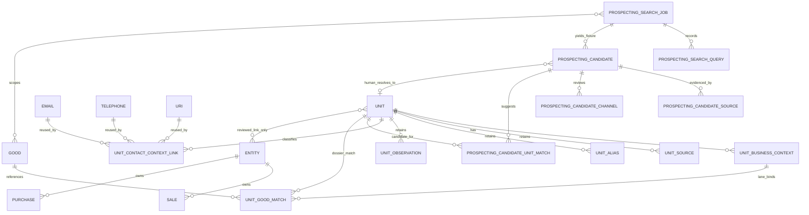

# Unit prospecting ER diagram

There is deliberately no Lead aggregate, no Candidate→Entity action, no Unit transaction copy, no `unit_contacts`, no score tables and no universal event table. SearchProvider/live discovery is not implemented until Stage 09.

## Stage 08R correction

The diagram above records the committed Stage 08 Good-first shape. The accepted Product-first correction is documented in [ADR-PRODUCT-FIRST-PROSPECTING-AND-GOOD-OFFER-FIT.md](ADR-PRODUCT-FIRST-PROSPECTING-AND-GOOD-OFFER-FIT.md). Its additive path is `ProspectingSearchJob → prospecting_search_job_products → Product`, `ProspectingCandidate → prospecting_candidate_products → Product`, and `UnitBusinessContext → UnitProductMatch → Product`. `UnitGoodMatch` is now an optional secondary child of `UnitProductMatch`; historical unlinked rows remain diagnostics.
